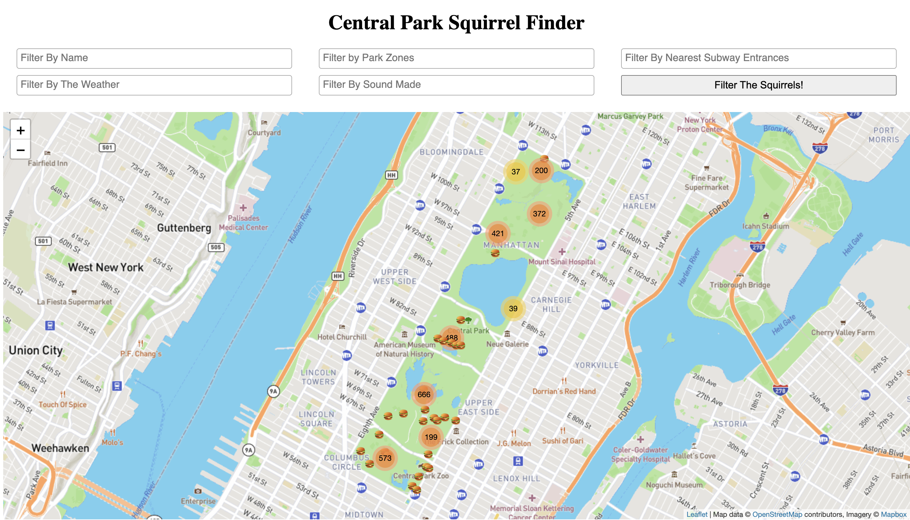

# Squirrel-Finder

# Central Park Squirrel Finder
For our Intro to Databases class at Columbia University, Marvin Chan and Ethan Ruoff created a Squirrel Finder Application currently based in Central Park. The purpose of our application is to allow avid squirrel fans to learn about squirrels in Central Park by examining the last sighting of their favorite squirrels, observing overall patterns among squirrel appearances, and viewing notable features within the proximity of said sighting. 

When looking back at our proposal for part 1 of our project, we are proud to state that we have completed all of the goals that we set for ourselves. The only part we didn’t implement that was mentioned in the part 1 proposal is a filter for age and color. We decided that these filters would clutter the UI while providing little to no benefit for the user experience and therefore didn’t implement them. Instead, we implemented a name filter that allows users to have more personal connections to the squirrels they’re viewing.

The demo for the Central Park Squirrel Finder can be viewed at http://34.75.34.18:8111. In this demo, users have access to an interactive map where they can easily filter to view squirrel sightings by the squirrel's name, park zone, weather, nearest subway station/train line, and noises made. A majority of our data is sourced from cityofnewyork.us, an openly available data site run by the city of New York. The exceptions to this are our weather data that is sourced from The National Centers For Environmental Information and the squirrel names which we found at data.world.

For our website, we have 1 web page that is able to dynamically filter squirrel sightings by selecting filter parameters from multiple dropdowns. To populate the dropdowns, we implemented multiple select statements that get the allowed drop-down values from multiple tables then pass the drop-down options to the front end. Once the user has selected the parameters to filter by, the user will then press “Filter The Squirrels!”, which would refresh 
the page with the filter parameters persisted and the squirrels that fit the criteria displayed. These filters persist by being passed back to the front-end through the server.py file.

To implement filtering, we joined together multiple tables of interest like squirrel, park_zone, subway_entrance, etc. to the spotted_at table. After the join clauses, we included dynamic where clauses to narrow down our result. Finally, we processed the results from the query into a JSON that contains the info that will appear in the squirrel pins. One detail to note is that some tables are joined by inner left joins while others are natural depending on if we wanted null parameters or not. For example, if a squirrel was spotted outside of the park we wouldn’t want to include it, but if a squirrel was spotted in the park without making any noises we would still include it.

